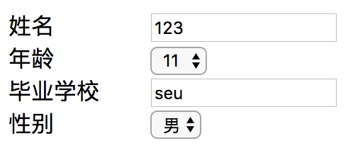

# react-dyn-form

> react的动态表单

#### 需求场景 ####
录入对象信息时，当对象属性信息较多，且属性信息类型不一致，此时如果使用静态表单，则会出现很多相似代码，难以调试及维护。
因此可以通过配置的方式控制各个表单项的组件类型及数据，将各个具体表单项和表单组件进行解耦。
#### 使用 ####
表单项配置
```
const compConfig = [
    {
        type: 'input',
        name: '姓名',
        value: '123'
    },
    {
        type: 'select',
        name: '年龄',
        value: 11,
        options: [11, 22, 33]
    },
    {
        type: 'input',
        name: '毕业学校',
        value: 'seu',

    },
    {
        type: 'select',
        name: '性别',
        value: '男',
        options: ['男', '女']
    },
];
```
动态组件调用
```
  <DynForm formConfig={compConfig} change={this.handleChange}/>
```
</br>
#### 参考 ####
https://github.com/robin2017/rbLib#5%E5%8A%A8%E6%80%81%E8%A1%A8%E5%8D%95
#### 总结 ####
